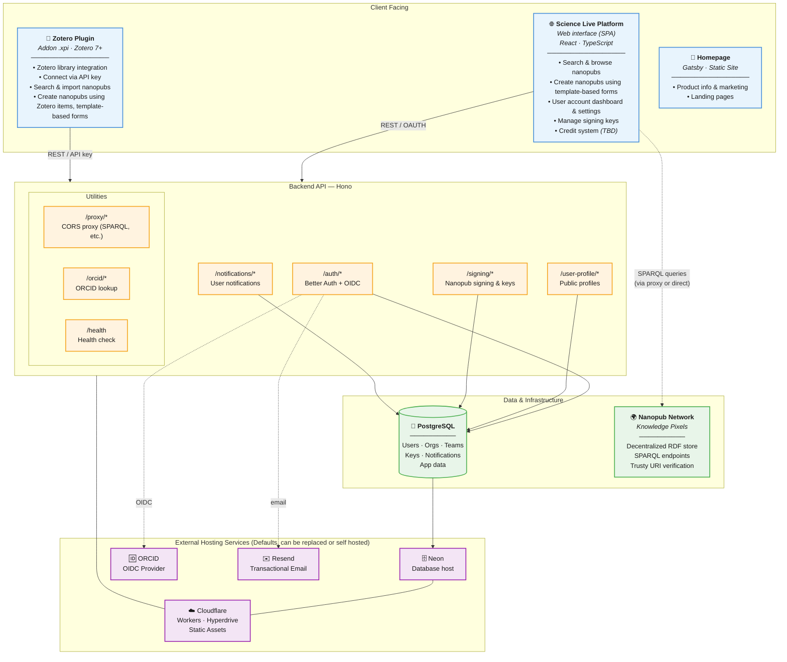

# Science Live Platform

Transform research into FAIR nanopublications — discoverable, reusable, and properly credited.

## Vision

Science Live enables researchers to create [FAIR](https://www.go-fair.org/fair-principles/) (Findable, Accessible, Interoperable, Reusable) [nanopublications](https://nanopub.net/) from every stage of their research — from systematic reviews to data analysis — making scientific work discoverable, reusable, and properly credited while advancing Open Science practices.

## Deployed Applications

### Science Live Platform (web)

The **Science Live Platform** lets anyone browse and create signed nanopublications via a user-friendly interface in a web browser.

Visit [**platform.sciencelive4all.org**](https://platform.sciencelive4all.org/) to get started

### Zotero Plugin

The **Science Live Zotero Plugin** lets researchers create signed nanopublications directly from their Zotero library, as well as search and import nanopubs into their library.

- **Download:** [science-live.xpi](https://github.com/ScienceLiveHub/science-live-platform/releases/latest)
- **Compatibility:** Zotero 7+
- **Install:** Download the `.xpi` file, then in Zotero go to Tools > Plugins and drag the `.xpi` onto the Plugins window.
- Auto-updates are supported via the Zotero plugin manager.
- In order to publish, you need a free [Science Live Platform](https://platform.sciencelive4all.org/) account.

## Project Status

| Phase     | Status      | Description                                               |
| --------- | ----------- | --------------------------------------------------------- |
| ✅ Step 1 | Complete    | Foundation setup (monorepo, React)                        |
| ✅ Step 2 | Complete    | Database integration (PostgreSQL)                         |
| ✅ Step 3 | Complete    | ORCID authentication and Org support                      |
| ✅ Step 4 | Complete    | Nanopub parser and viewer with display modes              |
| ✅ Step 5 | Complete    | Template processing engine for NP creation                |
| ✅ Step 6 | Complete    | Zotero plugin V1 release                                  |
| 🔄 Step 7 | In progress | AI tools for NP creation                                  |
| 🔄 Step 8 | In progress | AI-powered search and info presentation                   |
| ⏳ Step 9 | Planned     | Credit system (templates ready, awaiting first customers) |

## Architecture

### Architecture preferences

- Open Source
- GDPR compliant (TBD)
- Modern developer experience
- Serverless and low running cost (economical scale up and down)
- Option of deployment full data-sovereignty of user and app data
- Avoid hard-dependency on proprietary micro-services
  - Self-contained auth broker (better-auth), any OIDC provider can be added
  - Plain postgres database via connection string
  - Cloudflare is the default deployment but can be hosted elsewhere easily
- Future potential for private enterprise self-hosted instance



Currently the `frontend` is a static SPA, with no SSR required, and client-side routing using react-router-dom. All data is pulled from the `api` which includes authentication and the database connection, and all dynamic content (nanopubs) are on the Nanopub Network. This keeps the UX fast and responsive, as well as being easy to deploy as serverless without edge.

## Developer Quick Start

### Prerequisites

- Git
- A Postgres database and connection string
- **If using the recommended devcontainer:**
  - vscode (or other IDE that supports devcontainer)
  - Docker
- **If NOT using the recommended devcontainer** (which has everything built in), you need to manually install:
  - Node.js v24 or higher
  - npm (comes with Node.js)
  - Optional:
    - Zotero (if you want to develop the Zotero plugin)
    - Wrangler (if using Cloudflare)
    - Nektos act (if wanting to run `pr-check` script or test gh workflows)
- **If you want to deploy to Cloudflare:**
  - A [Cloudflare](https://dash.cloudflare.com) account (free tier works fine)
    - Either log into `wrangler` CLI (`npx wrangler login`), OR set your `CLOUDFLARE_API_TOKEN` and `CLOUDFLARE_ACCOUNT_ID` in both the frontend and api .env files
    - Set up a Cloudflare Hyperdrive connection to your postgres db, and take note of its its UUID.
    - Copy each of the `wrangler.jsonc.example` files under both `api/` and `frontend/` folders to `wrangler.jsonc` and enter your ENVS into them where you see `CHANGE_TO_...`.
    - Create a `frontend/.env.production` file which should specify `VITE_API_URL=` pointing to your production API url
  - Build and deploy everything from project root: `npm run build` then `npm run deploy`

### First-time Setup

1. **Clone repository**

   ```bash
   git clone https://github.com/ScienceLiveHub/science-live-platform.git
   cd science-live-platform
   ```

2. **Copy environment templates:**

   ```bash
   cp frontend/.env.example frontend/.env
   cp api/.env.example api/.env
   ```

3. **Update both `.env` with your settings and credentials**

   Mainly, the variables marked REQUIRED must be changed.

4. **Install project** (choose either a. or b.)

   a. _Using Devcontainer (recommended)_:
   Start the [devcontainer](https://code.visualstudio.com/docs/devcontainers/containers) by clicking the blue icon in the bottom-left-most corner of the vscode window. Wait for the container to build for the first time and start running. The running container will automatically close when you exit vscode.

   b. _Manual setup_:
   Install the [Prerequisites](#prerequisites) and then run `npm install`.

5. If you are starting with a blank database, run initial [database migrations](#database-migrations)

### Database migrations

You will need to run this initially on a blank database to set up the schema:

```bash
npm -w api run db:migrate
```

Then if you change the database [schema](./api/src/db/schema), you will need to generate the new migration and apply it to the db:

```bash
npm -w api run db:generate
npm -w api run db:migrate
```

### Running the app for local development:

#### Using vscode Run Task

1. You can hit `Ctrl + Shift + P`
2. Type "Run Task", `Enter`
3. Select the `runDevelopment` task to start the frontend Vite server and backend Wrangler/Bun server.

Alternatively use the `npm run dev` and `npm run dev:api` commands.

Visit http://localhost:3000 to see the application.

#### Using terminal

```bash
# Option 1: Run backend using Wrangler dev
npm run dev:api
# Option 2: Run backend using Bun
npm run dev:api-bun

# Run frontend using Vite
npm run dev
```

### Frontend UI Development

We are using **shadcn**, which is a tool to pull pre-made UI component code from online repositories. This allows for a high degree of customization and transparency of the UI, while still being as quick and easy to use as opaque imported UI libraries.

The components get pulled into the [frontend/src/components](frontend/src/components/ui) directory ready for import e.g.: `import { Button } from "@/components/ui/button";`

There is a helper script to pull new components, which must be run from the frontend folder:

```
cd frontend
npm run ui:add popover
```

There are basic [official components](https://ui.shadcn.com/docs/components) you can import and customize, or more powerful third-party composites available in [other repositories](https://www.shadcn.io/components).

Note that some of the components are just composites of simpler components, and you are expected to simply copy the component code into your app yourself rather than use the command.

Styling is done via **tailwindcss**. We should minimize the amount of custom css we need to manage. The main aspects of the theme can be edited in [frontend/src/styles/index.css](frontend/src/styles/index.css).

To adjust a specific UI elements style, layout, padding etc, use [tailwindcss](https://tailwindcss.com/docs) utility classes e.g.: `className="pt-6"` to set top padding of the element to 6.

### Package updates

Currently we dont have a update manager, so use `npx npm-check-updates -w` in the project root to check for package updates. Run with `-t minor` flag to only do minor udpates where there is low risk of breaking anything. Then run it again adding the `-u` flag to save updates to package.json, then `npm i` to install them. Make sure you check everything still works, particularly after major version increments.

Note: for packages installed from a git repo (e.g.`"nanopub-js": "github:vijay-prema/nanopub-js"` in package.json) you need to run install again e.g. `npm install github:vijay-prema/nanopub-js`.

## Testing

### Test Frontend

```bash
# Should show the homepage
open http://localhost:3000
```

### Test API Endpoints

```bash
# Health check
curl http://localhost:3001/health
```

## Technology Stack

#### Both Frontend and Backend

- **Node.js 24** - Runtime
- **TypeScript** - Type safety
- **Vitest** - Tests

#### Frontend

- **React 19** - Frontend Framework
- **shadcn/ui** - Components
- **Tailwind CSS** - CSS/Styling
- **Formedible** - Form generation using **Tanstack Form** and **Zod**
- **Lucide**/**Simple Icons** - Icon sets
- **React Router** - Client-side routing
- **Vite** - Build tool and Dev server

#### Backend

- **Hono** - API endpoints
- **Better-Auth** - Auth library and user management
- **Drizzle** - ORM
- **Wrangler** - Dev server and CLI for Cloudflare Serverless Deployment (optional)
- **Bun** - Alternative Dev server

#### Database

- **PostgreSQL** - Primary database
- **Knowledge Pixels Nanopub Network** - Decentralized RDF storage

#### Default 3rd-party Infrastructure used (can be easily changed)

- **Cloudflare** - Hosting and deployment
- **Neon** - Postgres database
- **Resend** - Email API
- **ORCID** - An OIDC provider
- **GitHub** - Version control

## Contributing

Contributions are welcome! Please open an issue or pull request.

### Development Team

- **Project Lead:** Anne Fouilloux (VitenHub AS)
- **Technical Architecture:** Knowledge Pixels + Prophet Town
- **Semantic Consulting:** Barbara Magagna (Mabablue)
- **Funding:** Astera Institute

## License

MIT — see [package.json](package.json).

## Links

- **Platform:** https://platform.sciencelive4all.org/
- **Website:** https://sciencelive4all.org
- **Zotero Plugin:** [Download .xpi](https://github.com/ScienceLiveHub/science-live-platform/releases/latest)

## Contact

- **Email:** contact@vitenhub.no
- **Book a Call:** https://calendly.com/anne-fouilloux/30min
- **LinkedIn:** https://www.linkedin.com/company/sciencelive

## Acknowledgments

Science Live is supported by the Astera Institute with planned transition to community-driven governance. Built on the nanopublication ecosystem infrastructure deployed by Knowledge Pixels.
