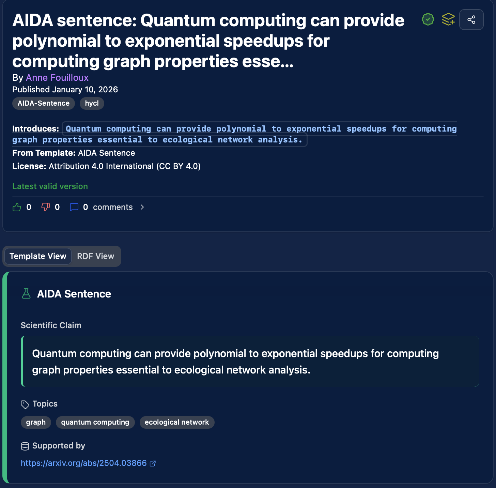
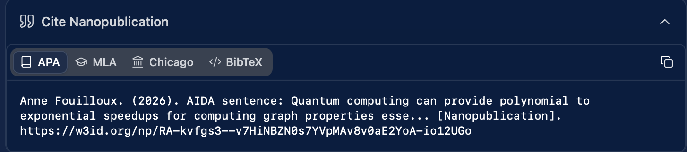
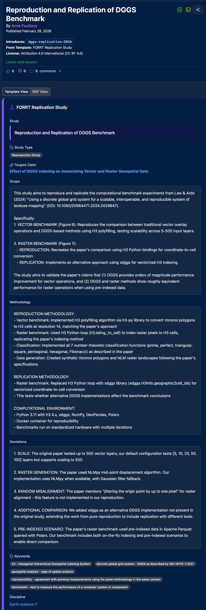
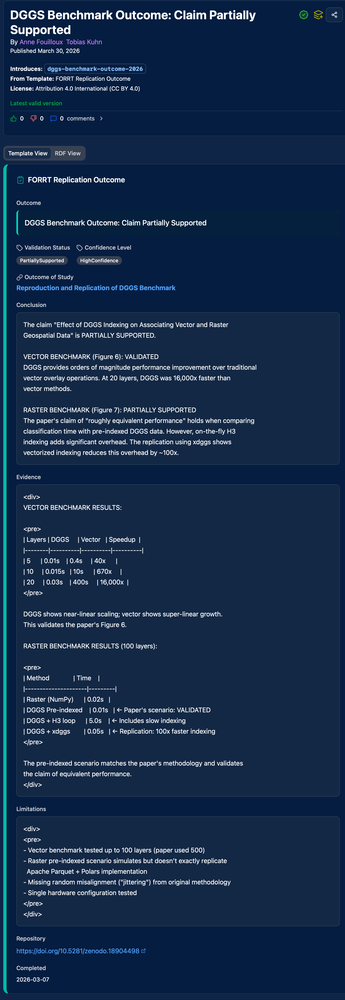

# Tutorial: Replicating a Research Claim

This tutorial walks through a real example: replicating a specific claim from a published paper about Discrete Global Grid Systems (DGGS). It demonstrates the atomic claim replication workflow — from identifying a claim to publishing machine-readable replication evidence.

---

## The scenario

Law & Ardo (2024) published a paper benchmarking DGGS for geospatial data processing. Among several findings, they make a specific claim:

> "DGGS provides orders of magnitude performance improvement for vector operations"

Rather than attempting to replicate the entire paper, we target **this specific claim** — an atomic, testable assertion.

---

## Step 1: State the claim as an AIDA sentence

The first step is to formalize the claim as a nanopublication using the **AIDA** template (Atomic, Independent, Declarative, Absolute). This turns a sentence in a PDF into a structured, citable, queryable object.

An AIDA sentence is:

- **Atomic** — one claim, not a paragraph
- **Independent** — understandable on its own
- **Declarative** — states a fact, not a question
- **Absolute** — no hedging ("may", "could", "suggests")

The claim becomes a nanopublication linked to the original paper's DOI, published through your Science Live account.

Here's what a published AIDA sentence looks like on the platform:



Every nanopublication is also citable in standard academic formats (APA, MLA, Chicago, BibTeX):



---

## Step 2: Design the replication study

Next, create a **FORRT Replication Study** nanopublication that describes how you will test the claim. This uses the FORRT template, which structures:

- **Study type** — Reproduction, Replication, or both
- **Scope** — What aspects of the original claim you're testing
- **Target claim** — Links to the AIDA nanopub from Step 1
- **Methodology** — How your approach compares to the original

For computational replications, the **FORRT-KL** (Knowledge Loom) template adds structured metadata:

| Field | Example from the DGGS study |
|-------|---------------------------|
| Software method | `h3.polyfill()`, `xdggs.index()` |
| Software package | `h3-py 4.1.0`, `xdggs 0.2.0` |
| Runtime environment | `Python 3.11 (Docker)` |
| Input data source | Synthetic Voronoi polygons, raster landscapes |
| Analysis script | URL to the replication repository |
| Knowledge Loom record | URL to the GitLab/GitHub repo |

This level of detail makes the replication fully reproducible — not just by humans, but by machines through the structured computational records captured by [Knowledge Loom](https://knowledgeloom.tib.eu) (via [dtreg](https://arxiv.org/html/2512.10836), a data type registry for reproducible analyses).

Here's what the published replication study design looks like on the platform:



---

## Step 3: Run the replication and publish the outcome

After conducting the replication, publish a **FORRT Replication Outcome** nanopublication with:

- **Result** — Did the claim hold? Fully replicated, partially replicated, or not replicated?
- **Key findings** — Numerical results (e.g., `F=7.285, p<0.001`)
- **Deviations** — How your setup differed from the original (e.g., reduced scale, alternative implementations)
- **Machine-readable proof** — Link to the Knowledge Loom record with full analysis details
- **Analysis type** — e.g., ANOVA, regression, t-test

In the DGGS example, the replication confirmed the vector performance claim but also documented deviations:

- Tested at reduced scale (5-100 layers vs. 500)
- Added an alternative DGGS implementation (xdggs) not in the original
- Used a modified raster generation approach

These deviations are not failures — they're documented, structured data that others can build on.

Here's what the published replication outcome looks like:



---

## Step 4: The result

You now have a chain of linked nanopublications:

```
Paper claim (PDF)
  → AIDA sentence (nanopub) — the formal, atomic claim
    → FORRT-KL Replication Study (nanopub) — the study design with computational metadata
      → FORRT-KL Replication Outcome (nanopub) — the result with machine-readable proof
```

Each link is a citable, queryable scholarly object. Together, they answer:

- **"Has this claim been tested?"** — Yes, the replication study exists
- **"By whom?"** — Signed with the researcher's ORCID
- **"What was the result?"** — Structured outcome with key numerical findings
- **"Can I reproduce it?"** — Full computational metadata and analysis scripts provided
- **"Were there deviations?"** — Documented and structured

[View the DGGS replication nanopub on the network](https://w3id.org/np/RADCSRkRrlaOzRZ-lkPh1dnvthkhqFz55eGr1wtpW03vk/dggs-replication-2026){ .md-button }

---

## Why this matters

### For researchers

- Your replication work is **citable** — not buried in supplementary materials
- You earn **credits** toward travel grants and platform features
- Your expertise in this area becomes **discoverable**
- The work is publishable in [FORRT's R2 Journal](https://forrt.org/replication-hub/)

### For the community

- Anyone can query "has this DGGS claim been replicated?" and get a structured answer
- The next researcher doesn't start from scratch — they build on your evidence
- Deviations and alternative approaches are documented, not lost

### For organizations

- A company evaluating DGGS technology can query the replication evidence directly
- The evidence is structured and verifiable, not a consultant's opinion
- Organizations can **post bounties** for claims they need replicated

---

## Try it yourself

1. [Create a Science Live account](https://platform.sciencelive4all.org) or [install the Zotero plugin](../zotero/getting-started/installation.md)
2. Find a paper with a claim you want to test
3. Create an AIDA sentence nanopub for the claim
4. Design your replication study using the FORRT or FORRT-KL template
5. Publish your outcome with the evidence

[Get started](../getting-started.md){ .md-button .md-button--primary }
