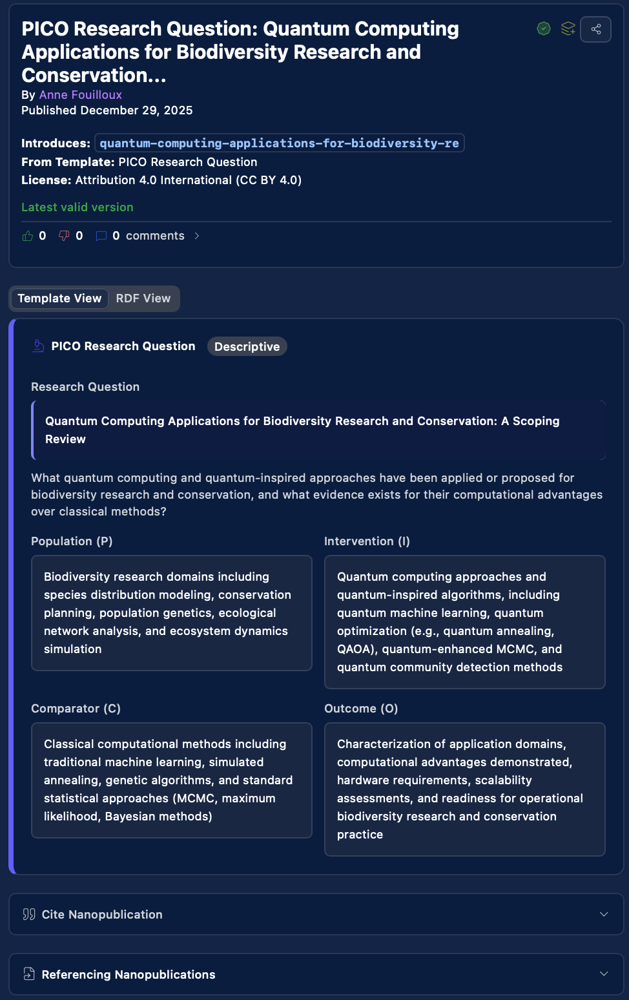
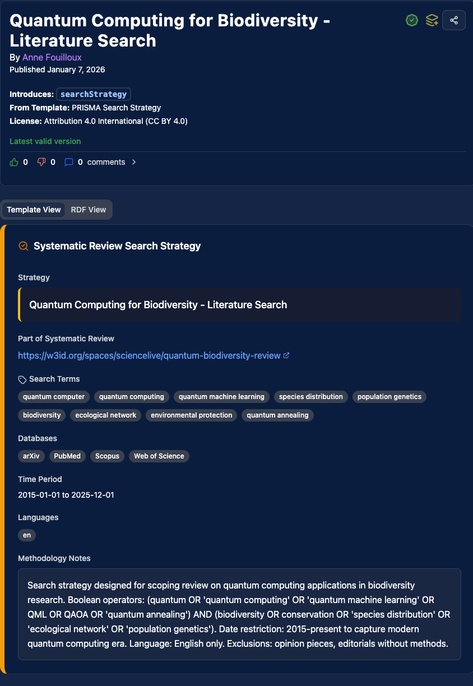
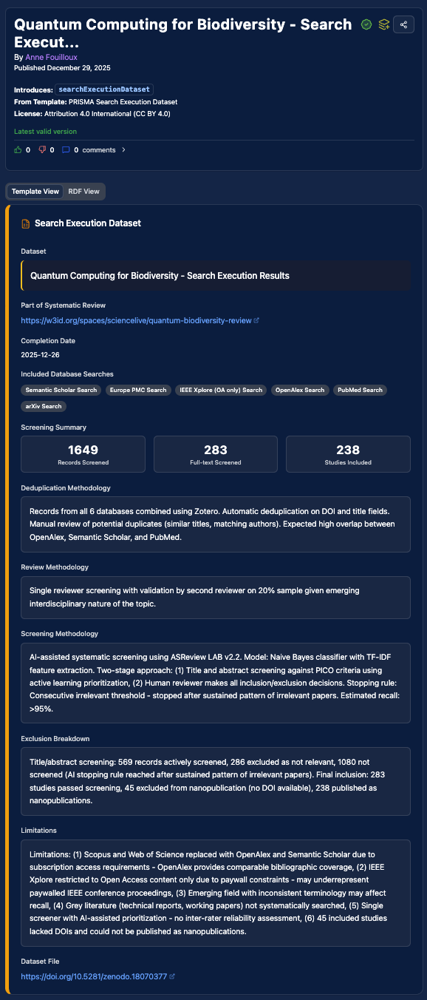
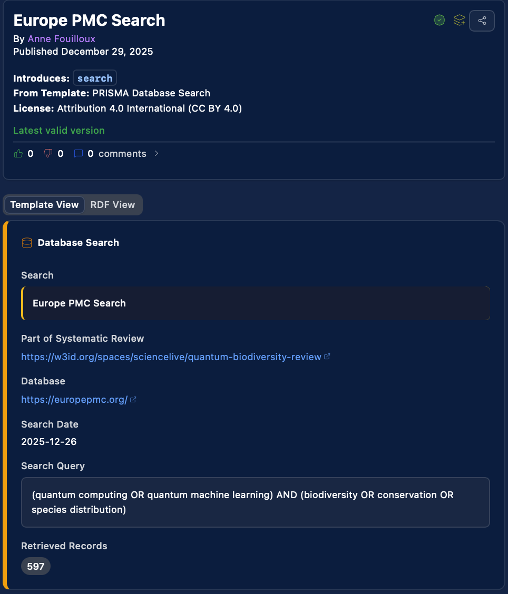

# Tutorial: A Living Systematic Review

This tutorial walks through a real example: a PRISMA-compliant scoping review of quantum computing applications for biodiversity research. It demonstrates how a systematic review becomes a living, queryable knowledge graph — not a static PDF.

---

## The scenario

You want to answer: **"What quantum computing methods have been applied to biodiversity research and conservation?"**

This is a broad, interdisciplinary question that requires searching multiple databases, screening hundreds of records, and synthesizing findings. Traditionally, the result is a review paper — valuable, but static and not machine-readable.

With Science Live, each step of the PRISMA workflow becomes a structured nanopublication. The entire review is a queryable Space that grows as new evidence emerges.

---

## Step 1: Define the research question

Create a nanopublication that formally states your research question. This becomes the anchor for the entire review — all subsequent nanopubs link back to it.

> "Quantum Computing Applications for Biodiversity Research and Conservation: A Scoping Review"

This nanopub specifies:

- The research question in PICO/PCC format
- The review type (scoping review)
- The time frame (December 2025 – December 2026)
- The administrators (linked via ORCID)

Here's what the published research question looks like on the platform:



---

## Step 2: Build search strategies

For each database you search, create a **PRISMA Search Strategy** nanopublication. Each one documents:

- **Database** — which source you searched
- **Search query** — the exact terms and Boolean operators
- **Date of search** — when the search was executed
- **Results count** — how many records were retrieved

In the quantum biodiversity review, six databases were searched:

| Database | Query | Results |
|----------|-------|---------|
| Europe PMC | `(quantum computing OR quantum machine learning) AND (biodiversity OR conservation OR species distribution)` | 597 |
| OpenAlex | Expanded terminology including quantum sensing, quantum simulation | 467 |
| Semantic Scholar | Same core query | 621 |
| arXiv | Focused on preprints | 178 |
| PubMed | Core biomedical literature | 4 |
| IEEE Xplore | Engineering and computing (open access only) | 0 |

Each search strategy is its own nanopublication — citable, auditable, and reproducible. Anyone can re-run the exact same search to verify the results.

Here's what a published search strategy looks like on the platform:



---

## Step 3: Document the search execution

Create a **PRISMA Search Execution Dataset** nanopublication that summarizes the overall screening flow:

- **Total records retrieved:** 1,649
- **Records screened:** 283
- **Full-text review:** 238
- **Studies included:** 239

This follows the PRISMA flow diagram structure, but as structured data rather than an image.

Here's what a published search execution dataset looks like:



---

## Step 4: Screen and assess studies

For each study that passes screening, create assessment nanopublications that document:

- Whether the study meets inclusion criteria
- Quality assessment scores
- Key findings extracted from the paper

In the quantum biodiversity review, extracted findings include:

- Quantum speedups for graph-based network analysis in ecology
- Current hardware constraints (NISQ devices) limiting practical applications
- The state preparation bottleneck as a key challenge for ecological data
- Applications to nonlinear ecological models (Lotka-Volterra systems)
- Gaussian process regression advantages for species distribution modelling

Each extracted finding is a separate nanopublication — citable, queryable, and linked to the specific paper it came from.

Individual database searches are also published as nanopubs, documenting the exact query, date, and result count:



---

## Step 5: The living Space

All nanopublications from the review are gathered in a **Space** — a shared collection that represents the entire systematic review:

```
Quantum Biodiversity Review (Space)
  ├── Research Question
  ├── Search Strategies (6 databases)
  ├── Search Execution Dataset
  ├── Study Assessments
  └── Extracted Findings
```

[View the quantum biodiversity review Space](https://w3id.org/spaces/sciencelive/quantum-biodiversity-review){ .md-button }

!!! note "Spaces on Science Live"
    Science Live is developing its own Spaces feature. Currently, Spaces are viewable on Nanodash. The links will be updated when the Science Live Spaces feature launches.

---

## Why this is different from a traditional review

| Traditional systematic review | Science Live systematic review |
|-------------------------------|-------------------------------|
| Static PDF published once | Living Space that grows with new evidence |
| Search strategies described in prose | Each search is a structured, reproducible nanopub |
| Screening documented in supplementary spreadsheet | Each assessment is a citable nanopub |
| Findings summarized in narrative | Each finding is a queryable, attributed data point |
| Updating requires a new publication | New nanopubs are added to the existing Space |
| Machine-unreadable | Fully queryable with SPARQL |

### What you can query

Once the review exists as nanopublications, anyone can ask:

- "What databases were searched for this review?"
- "How many records were found in each database?"
- "What quantum computing methods were identified for biodiversity?"
- "Which findings are related to species distribution modelling?"
- "Has the review been updated since [date]?"

These are structured queries, not keyword searches — they return precise, attributed answers.

---

## Why this matters

### For researchers

- Every step of your review is **citable** — not just the final paper
- The screening and extraction work is **visible and credited**
- You earn **credits** for each nanopub in the review
- Others can build on your search strategies and assessments without starting from scratch

### For the community

- The review is **living** — new evidence is added as nanopubs, not as a "version 2" paper years later
- Search strategies are **reproducible** — anyone can re-run them and verify
- Extracted findings are **queryable** — useful for meta-analyses and evidence synthesis

### For organizations

- Query the evidence base directly: "What does the systematic evidence say about quantum computing for conservation?"
- Commission PRISMA reviews on topics that matter to your business
- Get structured, verifiable evidence trails — not consultant reports

---

## Try it yourself

1. [Create a Science Live account](https://platform.sciencelive4all.org) or [install the Zotero plugin](../zotero/getting-started/installation.md)
2. Define your research question as a nanopub
3. Create search strategy nanopubs for each database
4. Screen and assess studies using the PRISMA templates
5. Watch your living review Space grow

[Get started](../getting-started.md){ .md-button .md-button--primary }
