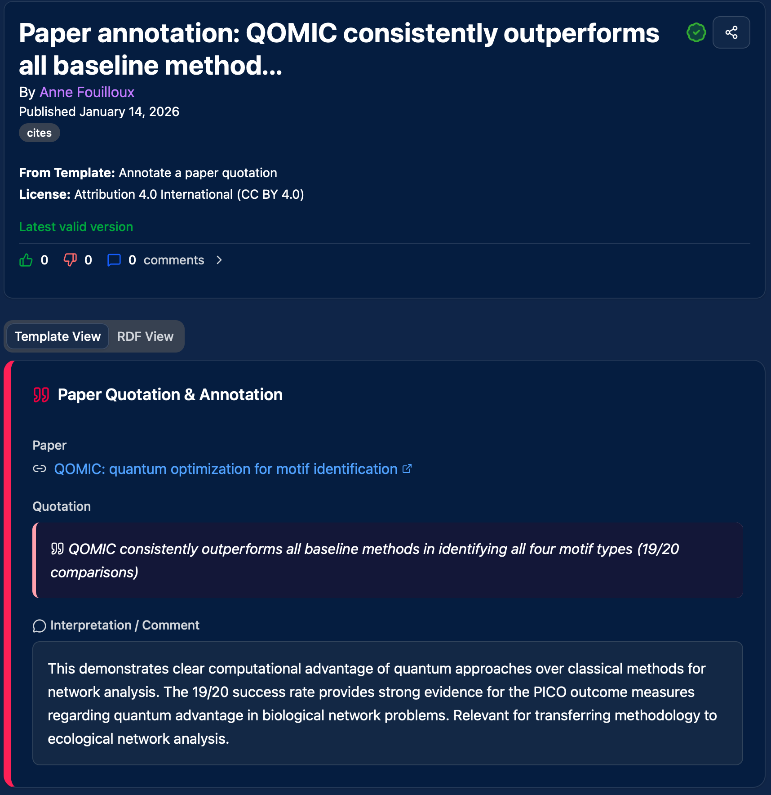

# Why Nanopublications?

## The problem: research knowledge is trapped

Every day, thousands of researchers read the same papers, extract the same facts, and store them in local notes that no one else can find. Meanwhile, companies and policymakers make decisions based on incomplete evidence because the knowledge they need is buried in PDFs.

AI amplifies this problem. A lab of 20 researchers each prompts an LLM to summarize the same 50 key papers — that's 1,000 redundant extraction calls, each producing slightly different, unverifiable results with no attribution to the original authors. To fully leverage and benefit from AI, we need to first solve these underlying issues: how knowledge is structured, shared, and attributed.

**What if a researcher could extract a finding once, and everyone else could just query it?**

That's what nanopublications do.

---

## What is a nanopublication?

A nanopublication is the smallest unit of publishable, machine-readable knowledge. It contains:

- **An assertion** — a single, precise claim (e.g., "DGGS provides orders of magnitude performance improvement for vector operations")
- **Provenance** — who made the claim, when, and based on what evidence
- **Publication info** — a permanent identifier, license, and cryptographic signature

Each nanopublication is:

- **Citable** — with a persistent URI, just like a DOI for a paper
- **Immutable and verifiable** — the content is cryptographically signed. The signature covers both the content and the author's identity, so any tampering is detectable. If the signature doesn't match the content, the nanopub is rejected by the network. Once published, a nanopublication cannot be altered.
- **Machine-readable** — structured as RDF, queryable with SPARQL
- **Permanent** — stored on the decentralized [nanopublication network](http://nanopub.net)
- **Open** — discoverable by anyone, anywhere

!!! info "Why immutability matters"
    Unlike a blog post, a wiki edit, or an AI-generated summary, a nanopublication is **tamper-proof**. The cryptographic signature guarantees that what you read is exactly what the author published — no silent edits, no platform interference, no content drift. This is what makes nanopublications trustworthy as citable scholarly objects.

Here's what a paper annotation looks like as a nanopublication — a quotation from a paper with the researcher's interpretation:

---

## Why this matters

### For researchers: your work gets recognized

Today, the most valuable intellectual work in science — reading, evaluating, synthesizing, replicating — is largely invisible. You spend weeks reviewing literature, and the result is a spreadsheet on your laptop. You replicate a study, and the evidence lives in a supplementary file no one reads.

With nanopublications:

- **Every contribution is citable.** Your literature annotations, citation assessments, replication outcomes — each one is a published scholarly object with your name on it.
- **You earn credits.** Science Live awards credits for quality contributions. Credits unlock advanced features and, more importantly, qualify you for [travel grants](#the-credit-system) funded by organizations that benefit from your research area.
- **Your expertise becomes discoverable.** When someone searches for evidence about your topic, they find *your* work — properly attributed.

!!! tip "This is not free labor"
    Science Live is not another platform that extracts value from underpaid researchers. Everything you contribute is yours — signed through your Science Live account, permanently citable, and rewarded through credits and funding. See [Recognition & Credits](for-researchers/recognition-and-credits.md) for details.

### For science: extract once, reuse forever

Consider the current workflow for a systematic review:

1. A researcher reads 200 papers and takes notes
2. Those notes are summarized in a PDF
3. The next researcher on the same topic starts from scratch

With nanopublications, each extracted finding is a structured, queryable object. The next researcher doesn't re-read 200 papers — they query the existing nanopubs and build on top of them.

**The environmental argument is real.** Every redundant LLM call to re-extract the same information from the same paper consumes energy for no new knowledge. Nanopublications are the cache layer for scientific knowledge — extract once, query forever.

### For organizations: evidence you can act on

Companies, policymakers, and funding agencies need answers to specific questions:

- "Has this drug mechanism been independently replicated?"
- "What's the systematic evidence for this intervention?"
- "Which claims in this field are well-supported vs. contested?"

Today, answering these questions requires commissioning expensive literature reviews or trusting LLM summaries with no provenance. With nanopublications, the answers are structured, verifiable, and queryable — with full traceability to the original researchers and papers.

Organizations can also **commission the research they need** by posting bounties for specific replication studies or systematic reviews. See [For Organizations](for-organizations/overview.md) for details.

---

## The credit system

Science Live features a credit system that turns contributions into real-world rewards:

1. **Publish nanopublications** — each quality contribution earns credits
2. **Build trust** — credits accumulate as your work is validated by peers
3. **Qualify for travel grants** — organizations fund travel to conferences and research events for researchers who advance their areas of interest
4. **Get recognized** — your contribution history is visible, citable, and linked to your ORCID

This isn't a gamification gimmick. It's a mechanism for organizations that benefit from open research to **fund the researchers who produce it**.

[Learn more about recognition and credits](for-researchers/recognition-and-credits.md){ .md-button }

---

## Atomic claims, not just whole papers

Reproducing an entire paper is valuable — it's the gold standard of academic replication and a cornerstone of open science. But not every question requires a full replication. A company evaluating a technology needs to know: "Does this specific claim hold?" A policymaker needs: "Is this particular finding supported?" They need actionable answers, and if the evidence is solid, they can act on it directly — or deep dive further if needed.

Science Live enables **atomic claim replication** alongside traditional approaches:

1. A specific claim is extracted from a paper and stated as an [AIDA sentence](https://w3id.org/np/RAuP5sKO7GWDYV7faLm2u2ij8sBHcN-x-yDE3VqWPxmGU) (Atomic, Independent, Declarative, Absolute)
2. A researcher designs a replication study targeting *that specific claim* — using [FORRT](https://forrt.org/) templates for the study design and optionally [Knowledge Loom](https://knowledgeloom.tib.eu) metadata for computational reproducibility
3. The replication outcome is published with machine-readable evidence — statistical results, analysis scripts, runtime environment
4. Anyone can now query: "Has this claim been replicated? By whom? With what result?"

This is faster, cheaper, and more useful than replicating entire papers. It's also what [FORRT's R2 Journal](https://forrt.org/replication-hub/) is designed to publish — and Science Live provides the infrastructure to make it queryable and connected.

[See the DGGS replication tutorial for a real example](tutorials/replication-study.md){ .md-button }

---

## A distributed ecosystem

Science Live is not a walled garden. It's one node in a distributed network of platforms that all speak the same language:

| Platform / Standard | Role |
|---------------------|------|
| **[Science Live](https://platform.sciencelive4all.org)** | Create, sign, publish, and discover nanopublications. Credit system and travel grants for researchers |
| **[FORRT](https://forrt.org/)** | Framework for replication studies. [R2 Journal](https://forrt.org/replication-hub/) for publishing replications. [FReD](https://forrt.org/replication-hub/) replication database |
| **[TIB Knowledge Loom](https://knowledgeloom.tib.eu)** | Open Science digital library of analysis-ready, reproducible knowledge. Captures the full computational context of an analysis (software, packages, data, scripts) as machine-readable records using [dtreg](https://arxiv.org/html/2512.10836) (data type registry) |
| **[PRISMA](http://prisma-statement.org/)** | International standard for transparent reporting of systematic reviews. Science Live implements PRISMA templates so that every step — research question, search strategy, screening, assessment — becomes a structured, queryable nanopublication |
| **[Nanopub Network](http://nanopub.net)** | Decentralized storage and discovery layer for all nanopublications |

Knowledge Loom produces structured, per-paper reproducibility records — Science Live can leverage these for individual claim reuse and discovery. A FORRT Knowledge Loom replication study links directly to the computational evidence captured by Knowledge Loom (methods, packages, runtime, results). A PRISMA review built in Zotero is queryable from anywhere on the network.

**No single platform owns the data. Every platform can use it.**

---

## Real examples

### A replication study (FORRT + Knowledge Loom)

A claim from a paper — "DGGS provides orders of magnitude performance improvement for vector operations" — is formally stated, independently replicated with documented methodology, and published with machine-readable evidence. Anyone can now query whether this specific claim holds up.

[View the DGGS replication nanopub](https://w3id.org/np/RADCSRkRrlaOzRZ-lkPh1dnvthkhqFz55eGr1wtpW03vk/dggs-replication-2026){ .md-button }
[Follow the step-by-step tutorial](tutorials/replication-study.md){ .md-button }

### A living systematic review (PRISMA)

A PRISMA-compliant scoping review of quantum computing for biodiversity — with search strategies across 6 databases, 1,649 records, structured screening and assessment — all as individual, queryable nanopublications in a shared Space.

[View the quantum biodiversity review](https://w3id.org/spaces/sciencelive/quantum-biodiversity-review){ .md-button }
[Follow the step-by-step tutorial](tutorials/systematic-review.md){ .md-button }

---

## Get started

-   **I'm a researcher**

    ---

    Start creating citable, credited nanopublications — from your browser or from Zotero.

    [Getting Started](getting-started.md){ .md-button .md-button--primary }

-   **I represent an organization**

    ---

    Commission research, fund replications, and query structured evidence.

    [For Organizations](for-organizations/overview.md){ .md-button .md-button--primary }

