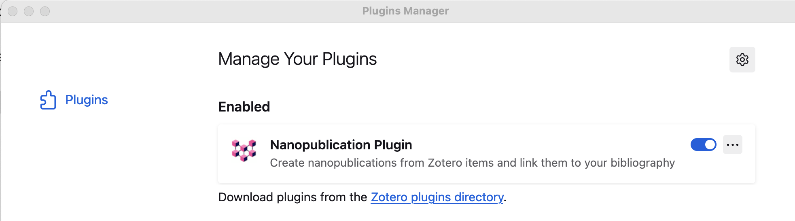
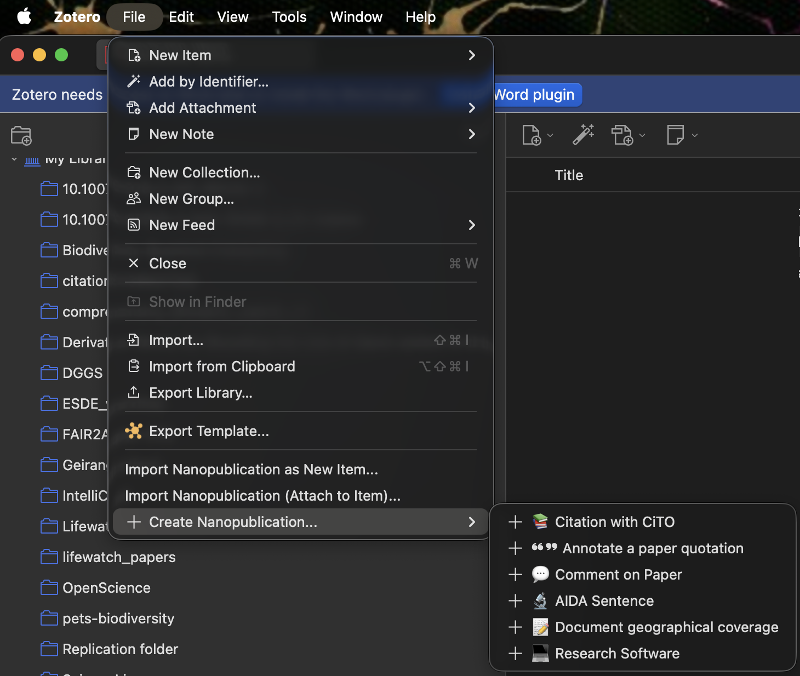

# Installation

## Prerequisites
- Zotero 7.0 or later
- Active internet connection
- [ORCID](https://orcid.org) account (required for creating nanopublications)

## Download and Install

1. Download the latest `.xpi` file from [GitHub Releases](https://github.com/ScienceLiveHub/science-live-platform/releases)
2. In Zotero, go to `Tools > Add-ons`
3. Drag the `.xpi` file into the Add-ons window
4. Restart Zotero when prompted

## Verify Installation

Right-click any item in your Zotero library and look for:

- "Create Nanopublication"
- "Attach Nanopublication"
- "Search Related Nanopublications"

{ width="300" }

Similar menu can be found from the "File" tab:

If you see these options, the installation was successful!

!!! info "Before you can publish"

    To create and publish nanopublications, you'll need a **Science Live account** with a verified email, linked ORCID, and an API key. The [Quick Start Guide](quick-start.md) walks you through this setup.

## Next Steps

- [Quick Start Guide](quick-start.md)
