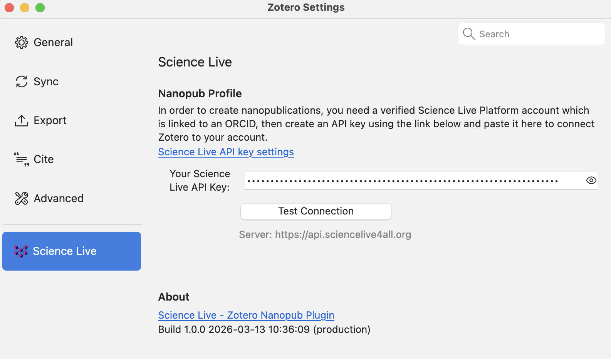
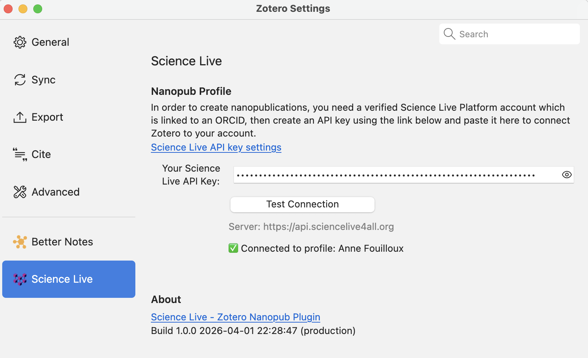
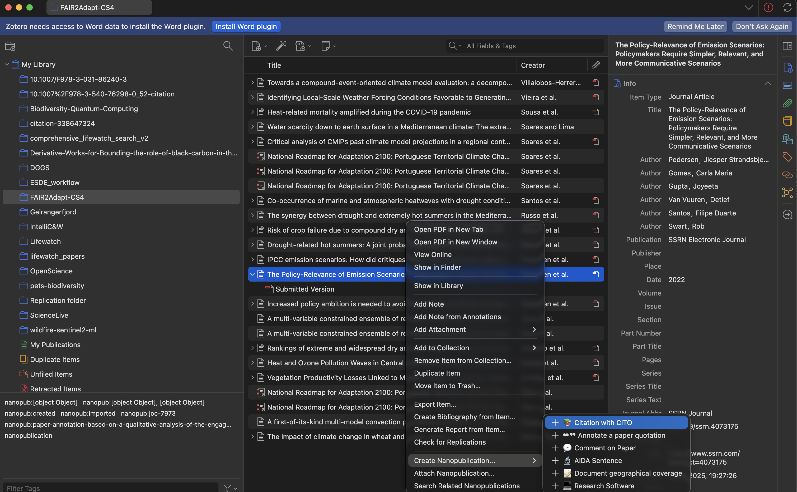
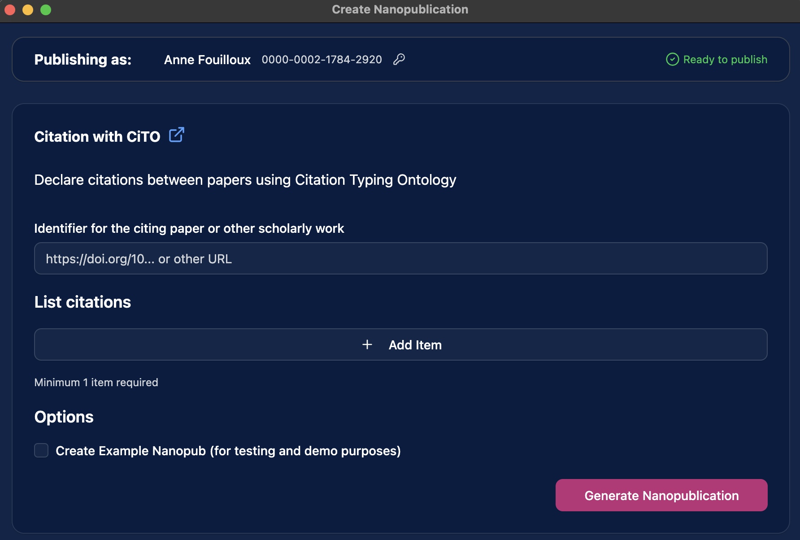
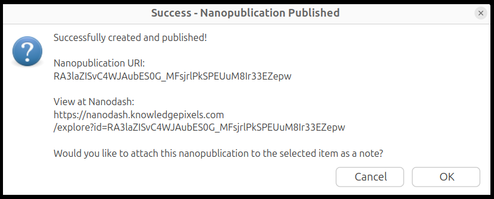
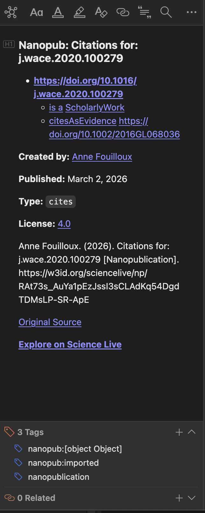

# Zotero Nanopublication Plugin

Transform your research workflow into semantic knowledge creation - **all within Zotero.**

[Get Started](getting-started/installation.md){ .md-button .md-button--primary }
[View on GitHub](https://github.com/ScienceLiveHub/science-live-platform){ .md-button }

---

## What This Plugin Does

The Zotero Nanopublication Plugin brings semantic web publishing **directly into Zotero** - no external websites, no context switching.

!!! tip "Key Benefits"

    - **All In-Zotero** - Create nanopubs without leaving your workspace
    - **Embedded Forms** - Smart forms generated from templates, rendered in Zotero tabs
    - **Discover** - Find related nanopublications from other researchers
    - **FAIR Principles** - Contribute to Findable, Accessible, Interoperable, Reusable science
    - **Authenticated** - Publishes through your Science Live account for proper attribution

---

## Quick Overview

=== "For Readers"

    **Annotate your readings semantically.**
    Transform reading notes into structured, citable statements. Create nanopubs about papers as you read them - all in Zotero.

=== "For Reviewers"

    **Write machine-readable reviews.**
    Use CiTO (Citation Typing Ontology) to describe paper relationships. Others can discover and build upon your evaluations.

=== "For Researchers"

    **Publish semantic claims.**
    Make formal research assertions with AIDA templates. Your claims become part of the global knowledge graph, published through your Science Live account.

---

## Features (v1.0.0)

- **In-Zotero Form Creation** - Entire workflow happens in Zotero tabs
- **Template Browser** - Choose from popular templates with one click
- **Multiple Templates** - CiTO, AIDA, PRISMA systematic review, [FORRT](https://forrt.org/) replication studies, and more
- **Auto-fill** - Paper metadata automatically populated
- **Automatic Signing** - Publishes through your Science Live account via API key
- **Direct Publishing** - Publishes to nanopub network instantly
- **Rich Notes** - Beautiful display of nanopubs attached to your Zotero items
- **Search Integration** - Discover nanopubs about papers in your library
- **Import/Attach** - Add nanopubs as items or attach as notes
- **PDF Text Selection** - Create nanopubs directly from highlighted text
- **Dark Mode** - Seamless integration with Zotero's theme

---

## How It Works

### 1. Set up your account

Create a [Science Live](https://platform.sciencelive4all.org) account, verify your email, link your ORCID, and generate an API key. Then enter your API key in Zotero under **Settings → Science Live**.

Enter your API key and click **Test Connection** to verify everything works.

### 2. Pick a template

Right-click any paper in your library and choose **Create Nanopublication** → select a template.

{ width="600" }

### 3. Fill in the form

A form opens in a new Zotero tab, pre-filled with your paper's metadata. Add your content and click **Generate Nanopublication**.

### 4. Published!

The plugin signs and publishes your nanopublication through your Science Live account. A rich note is attached to your Zotero item.

{ width="400" }

**No browser windows. No external websites. All in Zotero!**

---

## Getting Help

!!! info "Documentation Sections"

    === "👤 For Users"

        - **[Installation Guide](getting-started/installation.md)** - Install in 2 minutes
        - **[Quick Start](getting-started/quick-start.md)** - First nanopub in 5 minutes
        - **[Feature Guide](user-guide/features.md)** - Complete capabilities overview
        - **[Templates Guide](user-guide/templates.md)** - When to use which template

    === "🔧 For Developers"

        - **[Architecture](technical/architecture.md)** - How it works under the hood
        - **[API Integration](technical/api-integration.md)** - Integration details
        - **[Contributing](development/contributing.md)** - Join development

---

## What are Nanopublications?

!!! question "New to Nanopublications?"

    Nanopublications are the smallest units of publishable information in machine-readable format:

    - **Assertion** - The core claim or statement
    - **Provenance** - Who made it, when, and how
    - **Publication Info** - Metadata about the nanopub itself

    This plugin helps you create nanopublications from your Zotero workflow, making your insights part of the semantic web of scientific knowledge.

    [Learn More →](http://nanopub.net){ .md-button }

---

## Part of Science Live Platform

This plugin is part of [Science Live](https://sciencelive4all.org) - transforming research into FAIR nanopublications.

**Science Live enables:**

- **FAIR Principles**: Findable, Accessible, Interoperable, Reusable
- **Open Science**: Transparent, collaborative research
- **Credit System**: Recognition for quality contributions ([learn more](../for-researchers/recognition-and-credits.md))

[Visit Science Live →](https://sciencelive4all.org){ .md-button }

---

## System Requirements

- **Zotero:** Version 8.0 or later
- **Internet:** Required for loading templates and publishing
- For publishing: **Science Live Platform account** with email verified, ORCID linked, and an API key (the plugin guides you through any missing steps)

**Supported Platforms:**

- Windows 10/11
- macOS 11+ (Intel and Apple Silicon)
- Linux (Ubuntu 20.04+, Fedora 34+)

---

## Quick Links

- 📖 [Documentation](getting-started/installation.md)
- 💻 [GitHub Repository](https://github.com/ScienceLiveHub/science-live-platform)
- 🐛 [Report Issue](https://github.com/ScienceLiveHub/science-live-platform/issues)
- 🌐 [Science Live](https://sciencelive4all.org)

---

## License & Credits

**License:** MIT

**Created by:** [ScienceLiveHub](https://github.com/ScienceLiveHub)  
**Contact:** contact@vitenhub.no

**Built with:**

- [nanopub-js](https://github.com/Nanopublication/nanopub-js) - signing library

**Powered by:** [Nanopublication Network](http://nanopub.net) via [Knowledge Pixels](https://knowledgepixels.com)

---

**Start publishing semantic knowledge today!** 🚀
